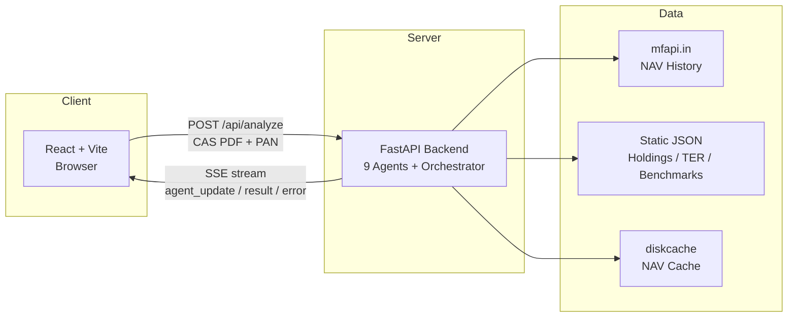
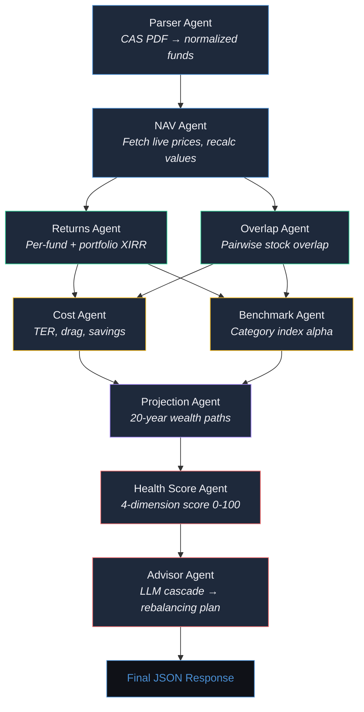
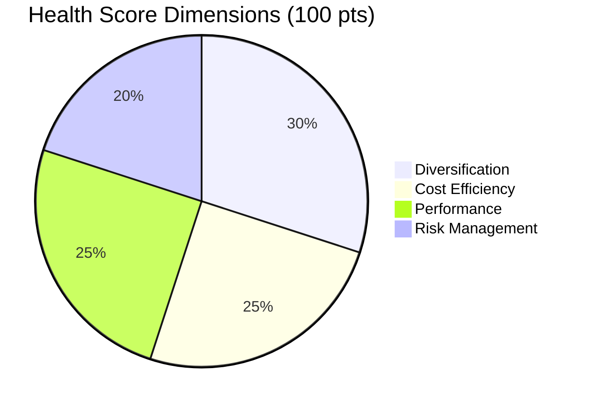
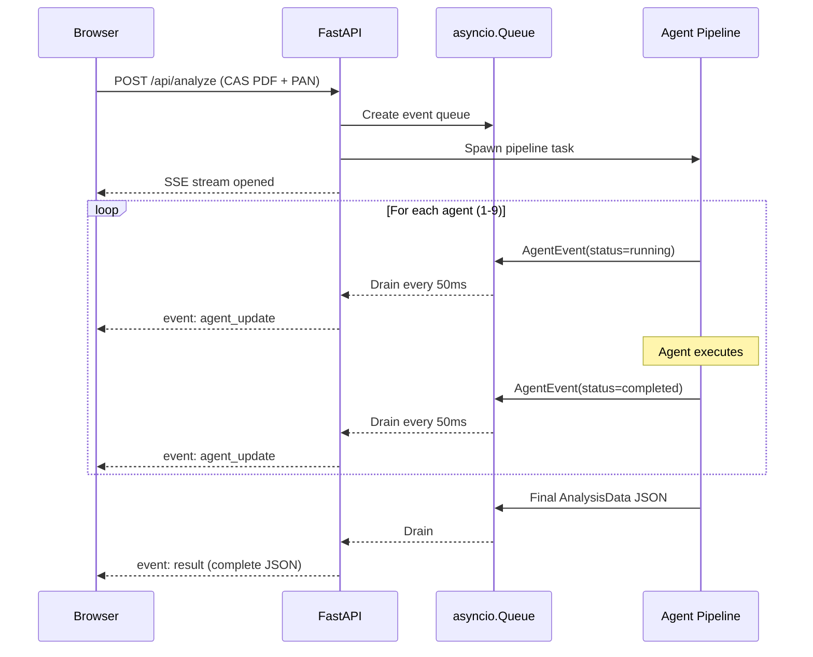
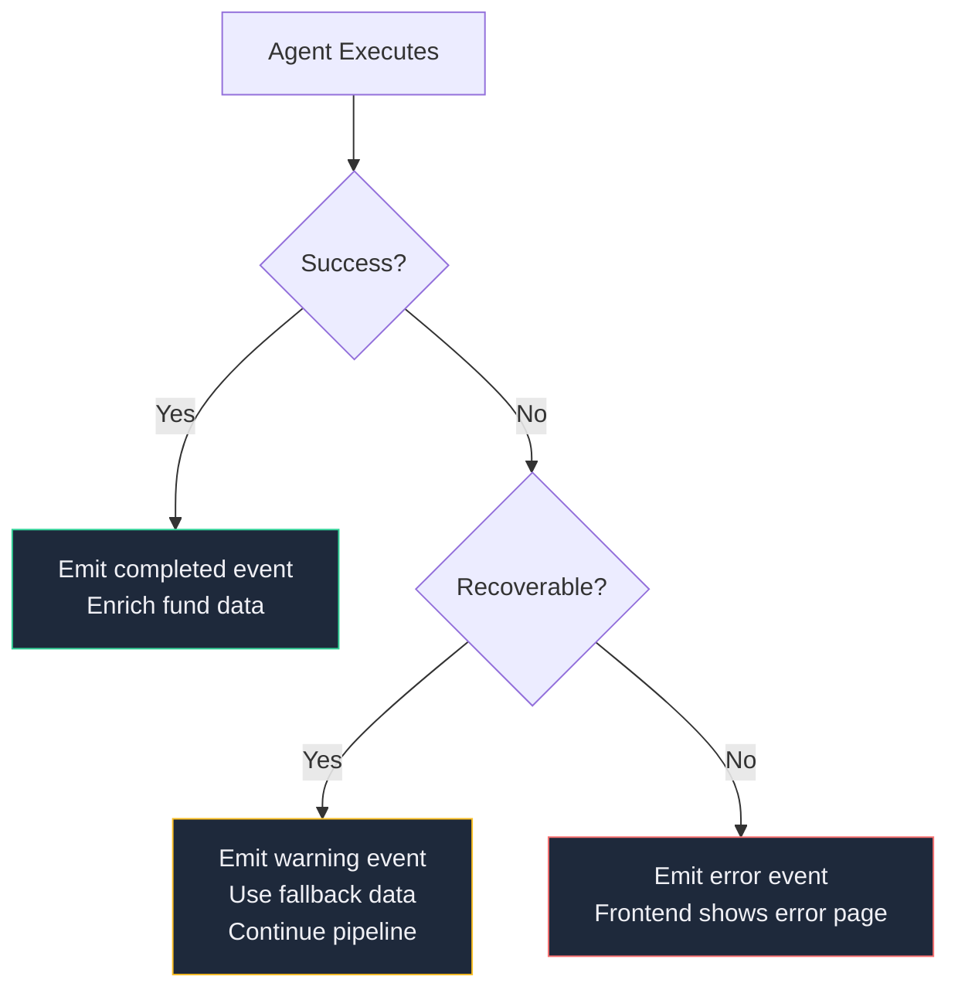
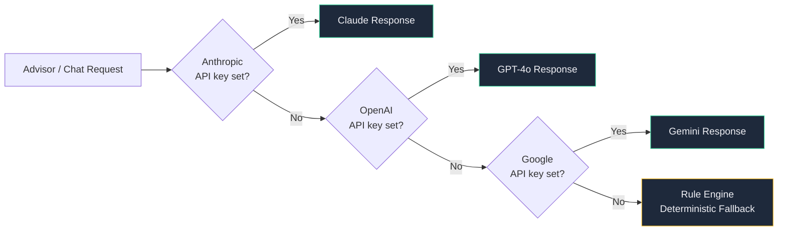
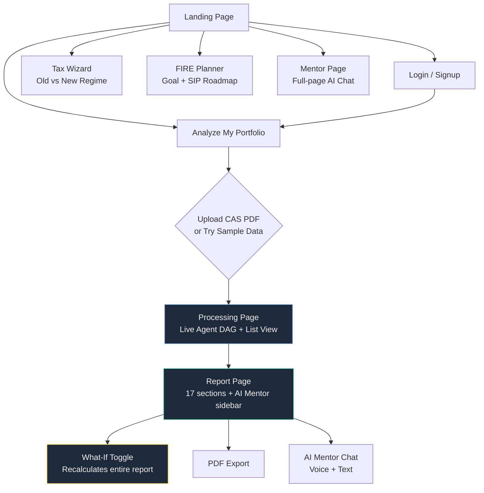

# ArthSaathi -- Architecture Document

**ET GenAI Hackathon 2026 | Problem Statement 9: AI Money Mentor**

## System Overview

ArthSaathi is a multi-agent portfolio analysis system. A user uploads a CAMS/KFintech Consolidated Account Statement (CAS) PDF. Nine domain-specific agents execute in a defined pipeline -- some sequentially, some in parallel -- producing a structured analysis that streams to the frontend in real time via Server-Sent Events (SSE).

No database. No paid API dependencies. The entire analysis runs statelessly from a single PDF.



### Agent Pipeline DAG



*Returns + Overlap run in parallel. Cost + Benchmark run in parallel. All other agents are sequential.*

## Agent Pipeline -- Inputs, Processing, Outputs

### 1. Parser Agent
- **Input:** PDF file bytes + PAN password
- **Processing:** casparser library (CAMS + KFintech support). Extracts investor info, folio structure, scheme-level transactions. Falls back to pdfminer text extraction for MFCentral format.
- **Output:** Normalized dict: `investor_info`, `statement_period`, array of folios with schemes and transactions
- **Error handling:** Raises `WRONG_PASSWORD` or `PARSE_FAILED` with specific error codes. Frontend receives these via SSE error event and displays contextual help.

### 2. NAV Agent
- **Input:** Fund list with AMFI scheme codes
- **Processing:** Fetches current and historical NAV from mfapi.in (free, no auth, 6x daily updates). Uses diskcache with 6-hour TTL to avoid redundant network calls. Recalculates `current_value = units x NAV`.
- **Output:** Enriched funds with `current_nav`, `current_value`, `nav_history[]`, `category`
- **Error handling:** If mfapi.in is unreachable or returns 502, falls back to CAS-embedded NAV and emits a warning event. Analysis continues with stale data rather than failing.

### 3. Returns Agent (parallel with Overlap)
- **Input:** Fund list with transactions and current values
- **Processing:** Per-fund XIRR via pyxirr (Rust-powered, 10-20x faster than scipy). Cashflow polarity: purchases negative, redemptions positive, current value as synthetic final positive flow. Excludes internal switches and dividend reinvestments from XIRR to avoid double-counting. Portfolio-level XIRR computed by aggregating all fund cashflows.
- **Output:** Per-fund `xirr` object (rate, display, holding period) + `portfolio_xirr`

### 4. Overlap Agent (parallel with Returns)
- **Input:** Equity funds with AMFI codes
- **Processing:** Loads curated `holdings.json` (top ~200 equity fund holdings by weight). Pairwise overlap = sum of min(weight_A, weight_B) for each common stock. Concentration analysis: aggregates effective stock weights across all holdings.
- **Output:** `overlap_matrix[]` with pairwise percentages and levels, `top_concentrated_stocks[]`

### 5. Cost Agent (parallel with Benchmark)
- **Input:** Fund list with current values
- **Processing:** TER lookup chain: (1) captn3m0 TER tracker CSV by AMFI code, (2) category-average fallback from `ter_estimates.json`. Computes annual drag (value x TER), 10-year projected drag with compounding, and savings available by switching regular plans to direct.
- **Output:** Per-fund `expense` object + `expense_summary` (total annual drag, savings potential, weighted average TER)

### 6. Benchmark Agent (parallel with Cost)
- **Input:** Fund list with XIRR and categories
- **Processing:** Maps fund category to index benchmark via `benchmark_map.json` (Large Cap -> Nifty 50 TRI, Mid Cap -> Midcap 150 TRI, etc.). Fetches index NAV history from mfapi.in. Computes benchmark CAGR over fund's holding period. Alpha = fund XIRR - benchmark CAGR.
- **Output:** Per-fund `benchmark` object (name, return, alpha, outperformed flag)

### 7. Projection Agent
- **Input:** Portfolio current value, XIRR, expense summary
- **Processing:** Projects two 20-year wealth paths: (1) current trajectory at current XIRR, (2) optimised trajectory after applying TER savings + 0.5% alpha improvement from rebalancing. Year-by-year compound growth. Wealth gap = difference between paths.
- **Output:** `current_path[]`, `optimised_path[]`, `gap_at_10yr`, `gap_at_20yr`, assumptions

### 8. Health Score Agent
- **Input:** Complete analysis dict (funds, overlap, expenses, benchmark)
- **Processing:** Four-dimension scoring (100 points total):



  - Diversification (30 pts): Based on max pairwise overlap
  - Cost efficiency (25 pts): Based on weighted average TER
  - Performance (25 pts): Based on benchmark alpha
  - Risk management (20 pts): Based on asset mix, category spread, AMC concentration
- **Output:** Score (0-100), grade (A-F), label, per-dimension breakdown with reasons

### 9. Advisor Agent
- **Input:** Complete analysis dict
- **Processing:** LLM cascade with deterministic fallback:
  1. Anthropic Claude (if API key configured)
  2. OpenAI GPT-4o (if API key configured)
  3. Google Gemini (if API key configured)
  4. Rule-based plan (zero API keys needed): generates structured markdown from analysis data -- annual drag, regular plan count, worst overlap pair, best/worst alpha fund, wealth gap
- **LLM prompt:** SEBI-registered-advisor tone. Four sections: What's Working, Biggest Problem, Three Actions, Quantified Savings. Never recommends specific funds. Always uses Indian number formatting.
- **Output:** Markdown rebalancing plan + `ai_provider` field indicating source

## Communication Pattern: SSE Streaming



Each SSE event carries an `AgentEvent` payload:

```json
{
  "event": "agent_update",
  "data": {
    "agent": "returns_agent",
    "status": "completed",
    "message": "Computed XIRR for 6 funds",
    "severity": "success",
    "step": 3,
    "total_steps": 6,
    "timestamp": 1711339200
  }
}
```

The frontend (`@microsoft/fetch-event-source`) parses these events into a reducer-based state machine (`analysis-context.tsx`), driving the real-time AgentDAG node states and progress indicators.

## Tool Integrations

| Tool | Purpose | Source |
|------|---------|--------|
| casparser 0.8.1 | CAS PDF parsing (CAMS + KFintech) | PyPI, MIT |
| pyxirr 0.10.8 | XIRR computation (Rust-powered) | PyPI, Apache 2.0 |
| mfapi.in | NAV history + fund metadata | Free API, no auth |
| diskcache 5.6.3 | Local NAV caching (SQLite-backed) | PyPI, Apache 2.0 |
| captn3m0/india-mutual-fund-ter-tracker | TER data by AMFI code | GitHub, daily updated |
| Anthropic / OpenAI / Gemini SDKs | Advisor + Mentor chat (optional) | API keys in .env |
| @xyflow/react + dagre | Agent pipeline DAG visualization | npm, MIT |
| jspdf + html2canvas-pro | PDF report export | npm, MIT |
| Web Speech API | Voice input (STT) + voice output (TTS) | Browser native |

## Error Handling Strategy



1. **Agent-level resilience:** Each agent catches its own errors, emits a warning SSE event, and allows the pipeline to continue. Failed fields appear as "N/A" or null in the final response rather than crashing the entire analysis.

2. **LLM cascade:** Advisor and chat services try three LLM providers in priority order. If all fail (or no API keys are configured), a deterministic rule engine generates structured responses from the analysis data. Zero external dependency required for a complete demo.



3. **Frontend recovery:** SSE errors are parsed by HTTP status code (413 -> file too large, 415 -> invalid file type). The error page (`/analyze/error`) shows contextual help text specific to the error code.

4. **NAV data staleness:** If mfapi.in is unavailable, the NAV agent uses CAS-embedded NAV values and flags the staleness in the UI. Analysis results remain valid, with a caveat badge on affected values.

## User Flow



## Frontend Architecture

| Layer | Technology | Role |
|-------|-----------|------|
| Routing | React Router v7 | 9 routes: landing, auth, analysis flow, standalone tools |
| State | useReducer + Context | Analysis data, agent events, file/password state |
| Streaming | @microsoft/fetch-event-source | POST + SSE for analysis and chat |
| Visualization | @xyflow/react + dagre | Agent pipeline DAG with live status updates |
| Charts | Recharts | Wealth gap projection, asset allocation |
| Animations | GSAP + Lenis | Scroll-triggered reveals, smooth scrolling |
| Design system | Tailwind + custom tokens | Dark theme, Fraunces (serif display), Syne (body), DM Mono (data) |
| UI primitives | shadcn/ui (Radix-based) | Dialogs, sheets, tooltips, collapsibles, tabs |
| PDF export | jspdf + html2canvas-pro | Client-side multi-page PDF from DOM capture |
| Voice | Web Speech API | Speech recognition (STT) + synthesis (TTS) in MentorChat |

## Data

- **No database.** Analysis is stateless -- PDF in, JSON out.
- **NAV cache:** diskcache (SQLite) under `backend/cache/`, 6-hour TTL, gitignored.
- **Static data files:** `holdings.json` (fund holdings), `ter_estimates.json` (category TER averages), `benchmark_map.json` (category-to-index mapping). Curated from AMFI and Value Research.
- **Auth:** File-based (`users.json`) with PBKDF2-SHA256 hashing. In-memory token store with 7-day TTL. Prototype-grade, not production auth.

## Deployment

```bash
# Backend
cd backend
python3.12 -m venv venv && source venv/bin/activate
pip install -r requirements.txt
uvicorn app.main:app --host 0.0.0.0 --port 8000

# Frontend
cd Frontend
pnpm install
VITE_API_URL=http://localhost:8000 pnpm dev
```

No Docker required. No cloud services required. Runs entirely on localhost.
