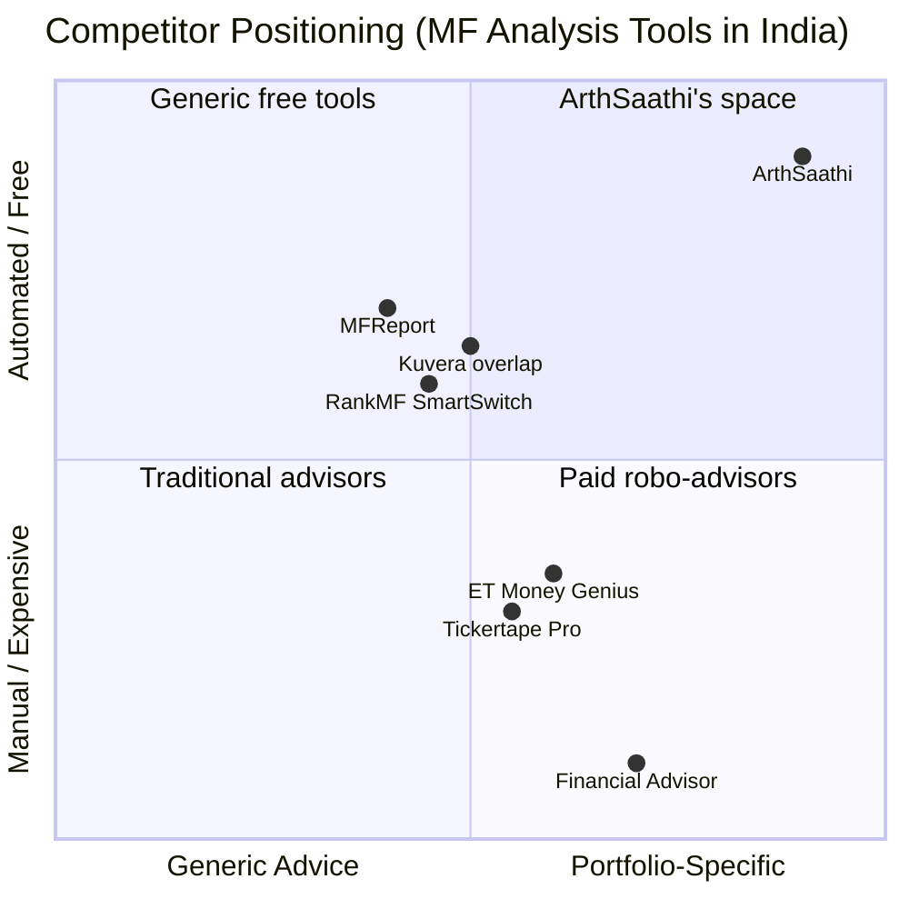

# ArthSaathi -- Impact Model

**ET GenAI Hackathon 2026 | Problem Statement 9: AI Money Mentor**

## The Problem (Quantified)

India's mutual fund industry has 27.06 crore folios held by 5.9 crore unique investors managing Rs 82.03 lakh crore in AUM (AMFI, February 2026). Of this:

- **51.4% of AUM sits in regular plans** (Cafemutual, December 2025), where embedded distributor commissions inflate expense ratios by 0.5-1.5% annually compared to direct plans.
- Distributors earned **Rs 21,107 crore in commissions** in FY 2024-25 (AMFI annual disclosure). This is money deducted from investor returns, not paid out-of-pocket -- most investors do not know they are paying it.
- **90% of large-cap funds underperformed their benchmark over 5 years; 73% over 10 years** (SPIVA India Mid-Year 2025, S&P Global). Investors are paying higher fees for worse returns.
- **95% of Indians do not have a financial plan** (PS 9 problem statement). Financial advisors charge Rs 25,000+ per year and serve only HNIs.
- **Zero free AI tools exist** that combine CAS parsing, multi-agent analysis, and portfolio-specific mentoring. Competitors offer partial solutions: XIRR-only calculators (MFReport), overlap detection without cost analysis (Kuvera), or generic AI chat without real portfolio data (ET Money Genius at Rs 999-2499/year).

## The Landscape

## Per-User Impact (Illustrative)

For a typical Indian mutual fund investor with Rs 32.5 lakh across 6-8 funds (mixed regular and direct plans):

| Metric | Before ArthSaathi | After ArthSaathi |
|--------|-------------------|-----------------|
| Awareness of actual XIRR | None (relies on fund house NAV) | Precise XIRR per fund + portfolio |
| Knowledge of expense drag | None | Exact rupee amount lost annually |
| Overlap detection | None | Pairwise stock overlap with severity |
| Benchmark comparison | None | Alpha per fund vs category index |
| Fee savings identified | None | Rs 15,000-45,000/year by switching to direct |
| 10-year compounded savings | None | Rs 3-8 lakh (depending on portfolio size and TER gap) |
| Time to get this analysis | Days (manual) or Rs 25,000+ (advisor) | Under 30 seconds |

## Time Saved

A chartered financial planner performing this analysis manually would need:

| Task | Manual Time | ArthSaathi |
|------|-------------|-----------|
| Parse CAS and extract scheme data | 30-45 min | 2 seconds (Parser Agent) |
| Look up current NAVs for all funds | 15-20 min | 3 seconds (NAV Agent, cached) |
| Calculate per-fund and portfolio XIRR | 45-60 min (Excel) | <1 second (pyxirr, Rust) |
| Check holdings overlap across funds | 60-90 min (Value Research manual lookup) | 1 second (Overlap Agent) |
| Compare TER and compute fee drag | 20-30 min | 1 second (Cost Agent) |
| Benchmark each fund against category index | 30-45 min | 2 seconds (Benchmark Agent) |
| Project wealth gap over 10-20 years | 20-30 min (spreadsheet model) | <1 second (Projection Agent) |
| Score portfolio health | Subjective, varies | 1 second (Health Agent, 4-dimension formula) |
| Write rebalancing recommendations | 30-60 min | 2 seconds (Advisor Agent) |
| **Total** | **4-6 hours** | **8-12 seconds** |

Reduction: **99.9% time savings.** What costs Rs 25,000 and takes a full working day becomes free and takes under 30 seconds.

```mermaid
gantt
    title Analysis Time Comparison
    dateFormat X
    axisFormat %s sec

    section Manual (4-6 hrs)
    Parse CAS :0, 2700
    Look up NAVs :2700, 3900
    Calculate XIRR :3900, 7500
    Check overlap :7500, 12900
    Compare TER :12900, 14700
    Benchmark :14700, 17400
    Project wealth :17400, 19200
    Write plan :19200, 22800

    section ArthSaathi (8-12 sec)
    Full pipeline :0, 12
```

## Cost Reduced

| Scenario | Traditional Cost | ArthSaathi |
|----------|-----------------|-----------|
| One-time portfolio review (advisor) | Rs 5,000-15,000 | Rs 0 |
| Annual financial planning (advisor) | Rs 25,000-50,000 | Rs 0 |
| Regular-to-direct switch consultation | Rs 2,000-5,000 per fund | Rs 0 (self-service via What-If simulator) |
| Ongoing portfolio monitoring (robo-advisory) | Rs 999-12,000/year (ET Money Genius, Tickertape Pro) | Rs 0 |

## Revenue Recovered (For Investors)

The fee drag identified by ArthSaathi represents money that is currently being transferred from investors to distributors via TER. This is not a theoretical saving -- it is money that compounds against the investor every year.

| Portfolio Size | Typical Regular Plan TER Gap | Annual Savings (Direct Switch) | 10-Year Compounded Savings |
|---------------|------------------------------|-------------------------------|---------------------------|
| Rs 5 lakh | 0.8% | Rs 4,000 | Rs 58,000 |
| Rs 15 lakh | 0.9% | Rs 13,500 | Rs 1.96 lakh |
| Rs 32.5 lakh | 1.0% | Rs 32,500 | Rs 4.73 lakh |
| Rs 75 lakh | 1.1% | Rs 82,500 | Rs 12.0 lakh |
| Rs 1.5 crore | 1.2% | Rs 1,80,000 | Rs 26.2 lakh |

Assumptions: 10-year horizon, 12% nominal portfolio return, TER gap between regular and direct plan, compounded annually. Conservative -- does not include rebalancing alpha or overlap reduction benefits.

## Scale Potential (if deployed on ET platform)

The Economic Times reaches 47 million monthly users (SimilarWeb, March 2026). ET Money, the financial services arm, has 10 million+ registered users.

| Metric | Conservative | Moderate | Aggressive |
|--------|-------------|----------|-----------|
| Users who upload CAS (Year 1) | 50,000 | 2,00,000 | 5,00,000 |
| Average portfolio size | Rs 15 lakh | Rs 20 lakh | Rs 25 lakh |
| Average annual savings identified | Rs 12,000 | Rs 18,000 | Rs 22,500 |
| **Total annual savings surfaced** | **Rs 60 crore** | **Rs 360 crore** | **Rs 1,125 crore** |
| Financial plans generated (free) | 50,000 | 2,00,000 | 5,00,000 |
| Equivalent advisor cost avoided | Rs 125 crore | Rs 500 crore | Rs 1,250 crore |

## Social Impact

1. **Financial inclusion:** ArthSaathi works from a standard CAS PDF -- available free from CAMS/KFintech/MFCentral to every mutual fund investor. No account linking, no PAN verification against third-party databases, no paid data sources.

2. **Transparency:** The fee ticker and What-If simulator make the invisible cost of regular plans viscerally visible. An investor who sees "you have lost Rs 47.32 since opening this report" understands expense ratios in a way that a percentage number never conveys.

3. **Accessibility:** Voice-enabled mentoring via Web Speech API. No typing needed. Financial guidance as simple as asking a question out loud.

4. **Trust:** Computation-first architecture. XIRR is calculated by pyxirr (deterministic Rust library), not approximated by an LLM. Overlap is computed from actual holdings data, not hallucinated. The LLM is used only for natural language synthesis of already-computed facts. Every number in the report is traceable to a specific agent and data source.

## Sources

- AMFI Monthly Data, February 2026: amfiindia.com/research-information/other-data/mf-scheme-performance-data
- AMFI Distributor Commission Disclosure, FY 2024-25: amfiindia.com
- SPIVA India Scorecard, Mid-Year 2025: spglobal.com/spdji/en/documents/spiva/spiva-india-mid-year-2025.pdf
- Cafemutual, Regular vs Direct AUM Split, December 2025: cafemutual.com
- Finance Act 2024, Capital Gains Tax Rates (FY 2025-26)
- Union Budget 2026 (February 1, 2026): No change to LTCG/STCG rates for mutual funds
- SEBI BER Framework, effective April 1, 2026
